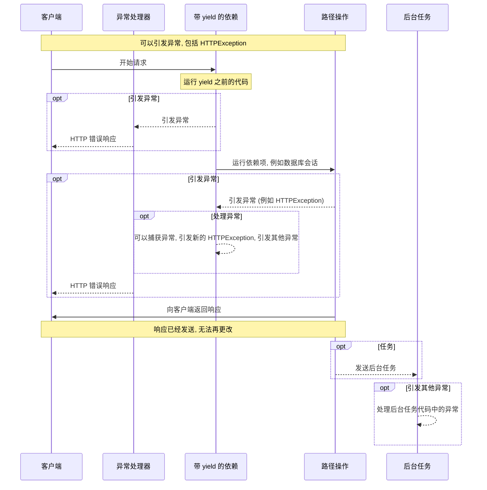

# 带有 yield 的依赖

__FastAPI__ 支持在完成后执行一些额外步骤的依赖项。

为此, 使用 `yield` 代替 `return`, 并在之后写入额外的步骤 (代码)。

提示

确保每个依赖项只使用一次 `yield`。

## 1. 带有 `yield` 的数据库依赖

例如, 你可以使用它来创建数据库会话并在完成后关闭它。

只有在创建响应之前才执行 `yield` 语句之前和包括 `yield` 语句在内的代码:

```python
# 定义一个带有 yield 的异步依赖函数
async def get_db():
    # 创建数据库会话实例
    db = DBSession()
    try:
        # yield 将数据库会话注入到路径操作中
        yield db
    finally:
        # 无论是否发生异常, 都会关闭数据库会话
        db.close()
```

yield 的值是注入到 _路径操作_ 和其他依赖项中的值:

```python
# 定义一个带有 yield 的异步依赖函数
async def get_db():
    # 创建数据库会话实例
    db = DBSession()
    try:
        # yield 将数据库会话注入到路径操作中
        # 这个 db 对象会被传递给使用此依赖的路径操作函数
        yield db
    finally:
        # 无论是否发生异常, 都会关闭数据库会话
        db.close()
```

`yield` 语句之后的代码在创建响应之后但在发送之前执行:

```python
# 定义一个带有 yield 的异步依赖函数
async def get_db():
    # 创建数据库会话实例
    db = DBSession()
    try:
        # yield 将数据库会话注入到路径操作中
        # 在这里, db 对象被提供给路径操作使用
        yield db
    finally:
        # 响应已创建, 但尚未发送给客户端
        # 在这里执行清理工作, 例如关闭数据库会话
        # 无论路径操作是否成功, 这段代码都会执行
        db.close()
```

提示

你可以使用 `async` 或普通函数。

__FastAPI__ 会对每个函数做正确的处理, 与普通依赖项一样。

## 2. 带有 `yield` 和 `try` 的依赖

如果你在带有 `yield` 的依赖项中使用 `try` 块, 你将收到使用该依赖项时抛出的任何异常。

例如, 如果中间某个代码, 在另一个依赖项或 _路径操作_ 中, 使数据库事务 "回滚" 或创建任何其他错误, 你将在你的依赖项中收到该异常。

因此, 你可以使用 `except SomeException` 在依赖项中查找该特定异常。

同样, 你可以使用 `finally` 来确保退出步骤被执行, 无论是否有异常。

```python
# 定义一个带有 yield 和异常处理的数据库依赖函数
async def get_db():
    # 创建数据库会话实例
    db = DBSession()
    try:
        # yield 将数据库会话注入到路径操作中
        # 在 try 块中, 任何发生的异常都会被下面的 except 捕获
        yield db
    finally:
        # 无论是否发生异常, 都会执行清理工作
        # 这确保数据库会话总是被正确关闭
        db.close()
```

## 3. 带有 `yield` 的子依赖

你可以拥有任何大小和形状的子依赖和子依赖 "树", 其中任何一个或全部都可以使用 `yield`。

__FastAPI__ 将确保每个带有 `yield` 的依赖项中的 "退出代码" 以正确的顺序运行。

例如, `dependency_c` 可以依赖于 `dependency_b`, 而 `dependency_b` 依赖于 `dependency_a`:

```python
# 从 typing 中导入 Annotated 用于类型注解
from typing import Annotated

# 从 fastapi 中导入 Depends
from fastapi import Depends

# 定义第一个依赖项 dependency_a
async def dependency_a():
    # 生成依赖项 a 的资源
    dep_a = generate_dep_a()
    try:
        # yield 将 dep_a 注入到依赖它的其他依赖项或路径操作中
        yield dep_a
    finally:
        # 清理 dep_a 资源
        dep_a.close()

# 定义第二个依赖项 dependency_b, 它依赖于 dependency_a
# dep_a 参数会自动接收 dependency_a yield 的值
async def dependency_b(dep_a: Annotated[DepA, Depends(dependency_a)]):
    # 生成依赖项 b 的资源
    dep_b = generate_dep_b()
    try:
        # yield 将 dep_b 注入到依赖它的其他依赖项或路径操作中
        yield dep_b
    finally:
        # 清理 dep_b 资源, 可能需要使用 dep_a
        dep_b.close(dep_a)

# 定义第三个依赖项 dependency_c, 它依赖于 dependency_b
# dep_b 参数会自动接收 dependency_b yield 的值
async def dependency_c(dep_b: Annotated[DepB, Depends(dependency_b)]):
    # 生成依赖项 c 的资源
    dep_c = generate_dep_c()
    try:
        # yield 将 dep_c 注入到依赖它的路径操作中
        yield dep_c
    finally:
        # 清理 dep_c 资源, 可能需要使用 dep_b
        dep_c.close(dep_b)
```

并且它们都可以使用 `yield`。

在这种情况下, `dependency_c` 要执行其退出代码, 需要来自 `dependency_b` 的值 (此处命名为 `dep_b`) 仍然可用。

而 `dependency_b` 又需要来自 `dependency_a` 的值 (此处命名为 `dep_a`) 可用于其退出代码。

```python
# 从 typing 中导入 Annotated 用于类型注解
from typing import Annotated

# 从 fastapi 中导入 Depends
from fastapi import Depends

# 定义第一个依赖项 dependency_a
async def dependency_a():
    # 生成依赖项 a 的资源
    dep_a = generate_dep_a()
    try:
        # yield dep_a, 使其可用于依赖它的 dependency_b
        # 注意: 此时 dep_a 的资源仍然保持打开状态
        yield dep_a
    finally:
        # 在所有依赖 dependency_c 的依赖项都处理完毕后
        # FastAPI 会以相反的顺序执行 finally 块
        # 因此 dep_a 会最后被清理
        dep_a.close()

# 定义第二个依赖项 dependency_b, 它依赖于 dependency_a
async def dependency_b(dep_a: Annotated[DepA, Depends(dependency_a)]):
    # 生成依赖项 b 的资源, 可能需要使用 dep_a
    dep_b = generate_dep_b()
    try:
        # yield dep_b, 使其可用于依赖它的 dependency_c
        # 此时 dep_a 和 dep_b 的资源都保持打开状态
        yield dep_b
    finally:
        # 在 dependency_c 处理完毕后执行
        # 但在 dep_a 清理之前执行
        # 清理 dep_b 时可能需要使用 dep_a
        dep_b.close(dep_a)

# 定义第三个依赖项 dependency_c, 它依赖于 dependency_b
async def dependency_c(dep_b: Annotated[DepB, Depends(dependency_b)]):
    # 生成依赖项 c 的资源, 可能需要使用 dep_b
    dep_c = generate_dep_c()
    try:
        # yield dep_c, 使其可用于路径操作
        # 此时 dep_a、dep_b 和 dep_c 的资源都保持打开状态
        yield dep_c
    finally:
        # 在路径操作完成后首先执行
        # 清理 dep_c 时可能需要使用 dep_b
        dep_c.close(dep_b)
```

同样, 你可以拥有一些带有 `yield` 的依赖项和一些其他带有 `return` 的依赖项, 并且其中一些依赖于其他一些。

你也可以拥有一个需要多个其他带有 `yield` 的依赖项的单个依赖项, 等等。

你可以拥有你想要的任何依赖项组合。

__FastAPI__ 将确保所有内容都以正确的顺序运行。

技术细节

这要归功于 Python 的上下文管理器。

__FastAPI__ 在内部使用它们来实现这一点。

## 4. 带有 `yield` 和 `HTTPException` 的依赖

你已经看到可以使用带有 `yield` 的依赖项并拥有捕获异常的 `try` 块。

同样, 你可以在 `yield` 之后的退出代码中引发 `HTTPException` 或类似的异常。

提示

这是一个有点高级的技术, 在大多数情况下, 你实际上不需要它, 因为你可以从应用程序代码的其余部分引发异常 (包括 `HTTPException`), 例如, 在 _路径操作函数_ 中。

但如果你需要它, 它就在那里。

```python
# 从 typing 中导入 Annotated 用于类型注解
from typing import Annotated

# 从 fastapi 中导入 Depends, FastAPI 和 HTTPException
from fastapi import Depends, FastAPI, HTTPException

# 创建 FastAPI 应用实例
app = FastAPI()

# 模拟的物品数据
data = {
    "plumbus": {"description": "Freshly pickled plumbus", "owner": "Morty"},
    "portal-gun": {"description": "Gun to create portals", "owner": "Rick"},
}

# 自定义异常类, 用于表示所有者错误
class OwnerError(Exception):
    pass

# 定义一个带有 yield 的依赖函数, 用于获取用户名
def get_username():
    try:
        # yield 用户名 "Rick"
        # 这个值会被注入到路径操作函数中
        yield "Rick"
    except OwnerError as e:
        # 如果在路径操作中抛出 OwnerError 异常
        # 在这里捕获它并转换为 HTTPException
        # 这发生在 yield 之后, 即响应创建之后但在发送之前
        raise HTTPException(status_code=400, detail=f"Owner error: {e}")

# 定义 GET 路径操作, 处理 /items/{item_id} 路径
@app.get("/items/{item_id}")
def get_item(item_id: str, username: Annotated[str, Depends(get_username)]):
    # 检查物品是否存在
    if item_id not in data:
        raise HTTPException(status_code=404, detail="Item not found")
    # 获取物品数据
    item = data[item_id]
    # 检查物品的所有者是否与当前用户匹配
    if item["owner"] != username:
        # 如果不匹配, 抛出 OwnerError 异常
        # 这个异常会被依赖函数 get_username 中的 except 捕获
        raise OwnerError(username)
    # 返回物品数据
    return item
```

你可以用来捕获异常 (并且可能还会引发另一个 `HTTPException`) 的另一种方法是创建自定义异常处理程序。

## 5. 带有 `yield` 和 `except` 的依赖

如果你在带有 `yield` 的依赖项中使用 `except` 捕获异常, 并且你没有再次引发它 (或引发新异常), FastAPI 将无法注意到有异常, 这与常规 Python 发生的方式相同:

```python
# 从 typing 中导入 Annotated 用于类型注解
from typing import Annotated

# 从 fastapi 中导入 Depends, FastAPI 和 HTTPException
from fastapi import Depends, FastAPI, HTTPException

# 创建 FastAPI 应用实例
app = FastAPI()

# 自定义异常类, 用于表示内部错误
class InternalError(Exception):
    pass

# 定义一个带有 yield 的依赖函数, 用于获取用户名
def get_username():
    try:
        # yield 用户名 "Rick"
        yield "Rick"
    except InternalError:
        # 捕获 InternalError 异常但不重新引发它
        # 这意味着 FastAPI 不会知道发生了异常
        print("Oops, we didn't raise again, Britney")

# 定义 GET 路径操作, 处理 /items/{item_id} 路径
@app.get("/items/{item_id}")
def get_item(item_id: str, username: Annotated[str, Depends(get_username)]):
    # 如果物品是 portal-gun, 抛出 InternalError 异常
    if item_id == "portal-gun":
        raise InternalError(
            f"The portal gun is too dangerous to be owned by {username}"
        )
    # 如果物品不是 plumbus, 抛出 HTTPException
    if item_id != "plumbus":
        raise HTTPException(
            status_code=404, detail="Item not found, there's only a plumbus here"
        )
    # 返回物品 ID
    return item_id
```

在这种情况下, 客户端将看到 _HTTP 500 内部服务器错误_ 响应, 这是应该的, 因为我们没有引发 `HTTPException` 或类似的异常, 但是服务器将 __没有任何日志__ 或任何其他关于错误的指示。

### 5.1 在带有 `yield` 和 `except` 的依赖项中始终 `raise`

如果你在带有 `yield` 的依赖项中捕获异常, 除非你正在引发另一个 `HTTPException` 或类似的异常, 否则你应该重新引发原始异常。

你可以使用 `raise` 重新引发相同的异常:

```python
# 从 typing 中导入 Annotated 用于类型注解
from typing import Annotated

# 从 fastapi 中导入 Depends, FastAPI 和 HTTPException
from fastapi import Depends, FastAPI, HTTPException

# 创建 FastAPI 应用实例
app = FastAPI()

# 自定义异常类, 用于表示内部错误
class InternalError(Exception):
    pass

# 定义一个带有 yield 的依赖函数, 用于获取用户名
def get_username():
    try:
        # yield 用户名 "Rick"
        yield "Rick"
    except InternalError:
        # 捕获 InternalError 异常并打印消息
        print("We don't swallow the internal error here, we raise again")
        # 重新引发异常, 使 FastAPI 能够正确处理它
        raise

# 定义 GET 路径操作, 处理 /items/{item_id} 路径
@app.get("/items/{item_id}")
def get_item(item_id: str, username: Annotated[str, Depends(get_username)]):
    # 如果物品是 portal-gun, 抛出 InternalError 异常
    if item_id == "portal-gun":
        raise InternalError(
            f"The portal gun is too dangerous to be owned by {username}"
        )
    # 如果物品不是 plumbus, 抛出 HTTPException
    if item_id != "plumbus":
        raise HTTPException(
            status_code=404, detail="Item not found, there's only a plumbus here"
        )
    # 返回物品 ID
    return item_id
```

现在客户端将获得相同的 _HTTP 500 内部服务器错误_ 响应, 但服务器将在日志中拥有我们的自定义 `InternalError`。

## 6. 带有 `yield` 的依赖项的执行

执行顺序或多或少像这个图表。时间从上到下流动。每一列是交互或执行代码的部分之一。



信息

只会向客户端发送 __一个响应__。它可能是错误响应之一, 或者将是来自 _路径操作_ 的响应。

发送其中一个响应后, 无法再发送其他响应。

提示

此图表显示了 `HTTPException`, 但你也可以引发在带有 `yield` 的依赖项或自定义异常处理程序中捕获的任何其他异常。

如果你引发任何异常, 它将被传递给带有 yield 的依赖项, 包括 `HTTPException`。在大多数情况下, 你将希望从带有 `yield` 的依赖项中重新引发相同的异常或新异常, 以确保它被正确处理。

## 7. 带有 `yield`, `HTTPException`, `except` 和后台任务的依赖项

警告

你很可能不需要这些技术细节, 你可以跳过本节并继续下面的内容。

这些细节主要在你使用 FastAPI 0.106.0 之前的版本并且在后台任务中使用了带有 `yield` 的依赖项的资源时才有用。

### 7.1 带有 `yield` 和 `except` 的依赖项, 技术细节

在 FastAPI 0.110.0 之前, 如果你使用带有 `yield` 的依赖项, 然后你在该依赖项中使用 `except` 捕获异常, 并且你没有再次引发异常, 该异常将自动引发/转发到任何异常处理程序或内部服务器错误处理程序。

这在 0.110.0 版本中进行了更改, 以修复来自转发的异常在没有处理程序 (内部服务器错误) 的情况下的未处理内存消耗, 并使其与常规 Python 代码的行为一致。

### 7.2 后台任务和带有 `yield` 的依赖项, 技术细节

在 FastAPI 0.106.0 之前, 在 `yield` 之后引发异常是不可能的, 带有 `yield` 的依赖项中的退出代码在发送响应 _之后_ 执行, 因此异常处理程序已经运行。

这样设计主要是为了允许在后台任务中使用依赖项 "yield" 的相同对象, 因为退出代码将在后台任务完成后执行。

然而, 由于这意味着在通过网络传输响应时在不必要的资源的情况下等待响应 (例如数据库连接), 这在 FastAPI 0.106.0 中进行了更改。

提示

此外, 后台任务通常是一组独立的逻辑, 应该单独处理, 具有自己的资源 (例如自己的数据库连接)。

因此, 这样你可能会有更清晰的代码。

如果你以前依赖这种行为, 现在你应该在后台任务本身内部为后台任务创建资源, 并且在内部只使用不依赖于带有 `yield` 的依赖项的资源的数据。

例如, 不使用相同的数据库会话, 你将在后台任务内部创建一个新的数据库会话, 并且你将使用这个新会话从数据库获取对象。然后, 你不会将数据库中的对象作为参数传递给后台任务函数, 而是传递该对象的 ID, 然后在后台任务函数内部再次获取该对象。

## 8. 上下文管理器

### 8.1 什么是 "上下文管理器"

"上下文管理器" 是你可以在 `with` 语句中使用的任何 Python 对象。

例如, 你可以使用 `with` 来读取文件:

```python
# 使用 with 语句打开文件
# open() 函数返回一个文件对象, 它是一个上下文管理器
with open("./somefile.txt") as f:
    # 读取文件内容
    contents = f.read()
    # 打印文件内容
    print(contents)
# with 块结束后, 文件会自动关闭, 即使发生了异常
```

在底层, `open("./somefile.txt")` 创建的对象称为 "上下文管理器"。

当 `with` 块完成时, 它确保关闭文件, 即使有异常。

当你创建带有 `yield` 的依赖项时, __FastAPI__ 将在内部为其创建一个上下文管理器, 并将其与其他一些相关工具结合使用。

### 8.2 在带有 `yield` 的依赖项中使用上下文管理器

警告

这或多或少是一个 "高级" 想法。

如果你刚刚开始使用 __FastAPI__, 你可能现在想跳过它。

在 Python 中, 你可以通过创建一个具有两个方法的类来创建上下文管理器: `__enter__()` 和 `__exit__()`。

你也可以通过在依赖项函数内部使用 `with` 或 `async with` 语句在 __FastAPI__ 带有 `yield` 的依赖项中使用它们:

```python
# 定义一个自定义的上下文管理器类
class MySuperContextManager:
    # 初始化方法, 创建数据库会话
    def __init__(self):
        # 创建数据库会话实例
        self.db = DBSession()

    # 进入上下文时调用 (with 块开始时)
    def __enter__(self):
        # 返回数据库会话对象
        return self.db

    # 退出上下文时调用 (with 块结束时)
    def __exit__(self, exc_type, exc_value, traceback):
        # 关闭数据库会话
        # 无论是否发生异常, 这个方法都会被调用
        self.db.close()

# 定义一个带有 yield 的异步依赖函数
async def get_db():
    # 使用自定义的上下文管理器
    # with 语句会自动调用 __enter__ 和 __exit__ 方法
    with MySuperContextManager() as db:
        # yield 数据库会话对象
        # 当路径操作完成后, with 块结束, __exit__ 会被自动调用
        yield db
```

提示

创建上下文管理器的另一种方法是使用:

- `@contextlib.contextmanager` 或
- `@contextlib.asynccontextmanager`

使用它们来装饰具有单个 `yield` 的函数。

这就是 __FastAPI__ 在内部用于带有 `yield` 的依赖项的东西。

但是你不必为 FastAPI 依赖项使用装饰器 (你不应该使用)。

FastAPI 将在内部为你完成。
