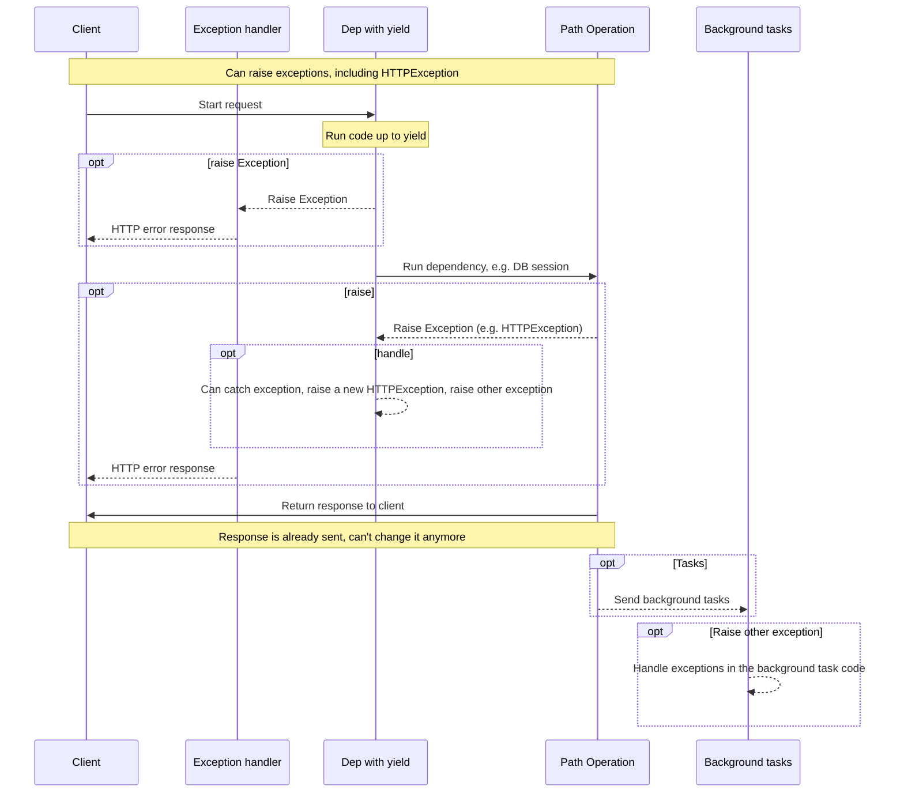

# Dependencies with yield

FastAPI supports dependencies that do some extra steps after finishing.

To do this, use `yield` instead of `return`, and write the extra steps (code) after.

Tip

Make sure to use `yield` one single time per dependency.

## 1. A database dependency with `yield`

For example, you could use this to create a database session and close it after finishing.

Only the code prior to and including the `yield` statement is executed before creating a response:

```python
async def get_db():
    db = DBSession()
    try:
        yield db
    finally:
        db.close()
```

The yielded value is what is injected into _path operations_ and other dependencies:

```python
async def get_db():
    db = DBSession()
    try:
        yield db
    finally:
        db.close()
```

The code following the `yield` statement is executed after creating the response but before sending it:

```python
async def get_db():
    db = DBSession()
    try:
        yield db
    finally:
        db.close()
```

Tip

You can use `async` or regular functions.

__FastAPI__ will do the right thing with each, the same as with normal dependencies.

## 2. A dependency with `yield` and `try`

If you use a `try` block in a dependency with `yield`, you'll receive any exception that was thrown when using the dependency.

For example, if some code at some point in the middle, in another dependency or in a _path operation_, made a database transaction "rollback" or create any other error, you will receive the exception in your dependency.

So, you can look for that specific exception inside the dependency with `except SomeException`.

In the same way, you can use `finally` to make sure the exit steps are executed, no matter if there was an exception or not.

```python
async def get_db():
    db = DBSession()
    try:
        yield db
    finally:
        db.close()
```

## 3. Sub-dependencies with `yield`

You can have sub-dependencies and "trees" of sub-dependencies of any size and shape, and any or all of them can use `yield`.

__FastAPI__ will make sure that the "exit code" in each dependency with `yield` is run in the correct order.

For example, `dependency_c` can have a dependency on `dependency_b`, and `dependency_b` on `dependency_a`:

```python
from typing import Annotated

from fastapi import Depends

async def dependency_a():
    dep_a = generate_dep_a()
    try:
        yield dep_a
    finally:
        dep_a.close()

async def dependency_b(dep_a: Annotated[DepA, Depends(dependency_a)]):
    dep_b = generate_dep_b()
    try:
        yield dep_b
    finally:
        dep_b.close(dep_a)

async def dependency_c(dep_b: Annotated[DepB, Depends(dependency_b)]):
    dep_c = generate_dep_c()
    try:
        yield dep_c
    finally:
        dep_c.close(dep_b)
```

And all of them can use `yield`.

In this case `dependency_c`, to execute its exit code, needs the value from `dependency_b` (here named `dep_b`) to still be available.

And, in turn, `dependency_b` needs the value from `dependency_a` (here named `dep_a`) to be available for its exit code.

```python
from typing import Annotated

from fastapi import Depends

async def dependency_a():
    dep_a = generate_dep_a()
    try:
        yield dep_a
    finally:
        dep_a.close()

async def dependency_b(dep_a: Annotated[DepA, Depends(dependency_a)]):
    dep_b = generate_dep_b()
    try:
        yield dep_b
    finally:
        dep_b.close(dep_a)

async def dependency_c(dep_b: Annotated[DepB, Depends(dependency_b)]):
    dep_c = generate_dep_c()
    try:
        yield dep_c
    finally:
        dep_c.close(dep_b)
```

The same way, you could have some dependencies with `yield` and some other dependencies with `return`, and have some of those depend on some of the others.

And you could have a single dependency that requires several other dependencies with `yield`, etc.

You can have any combinations of dependencies that you want.

__FastAPI__ will make sure everything is run in the correct order.

Technical Details

This works thanks to Python's Context Managers.

__FastAPI__ uses them internally to achieve this.

## 4. Dependencies with `yield` and `HTTPException`

You saw that you can use dependencies with `yield` and have `try` blocks that catch exceptions.

The same way, you could raise an `HTTPException` or similar in the exit code, after the `yield`.

Tip

This is a somewhat advanced technique, and in most of the cases you won't really need it, as you can raise exceptions (including `HTTPException`) from inside of the rest of your application code, for example, in the _path operation function_.

But it's there for you if you need it.

```python
from typing import Annotated

from fastapi import Depends, FastAPI, HTTPException

app = FastAPI()

data = {
    "plumbus": {"description": "Freshly pickled plumbus", "owner": "Morty"},
    "portal-gun": {"description": "Gun to create portals", "owner": "Rick"},
}

class OwnerError(Exception):
    pass

def get_username():
    try:
        yield "Rick"
    except OwnerError as e:
        raise HTTPException(status_code=400, detail=f"Owner error: {e}")

@app.get("/items/{item_id}")
def get_item(item_id: str, username: Annotated[str, Depends(get_username)]):
    if item_id not in data:
        raise HTTPException(status_code=404, detail="Item not found")
    item = data[item_id]
    if item["owner"] != username:
        raise OwnerError(username)
    return item
```

An alternative you could use to catch exceptions (and possibly also raise another `HTTPException`) is to create a Custom Exception Handler.

## 5. Dependencies with `yield` and `except`

If you catch an exception using `except` in a dependency with `yield` and you don't raise it again (or raise a new exception), FastAPI won't be able to notice there was an exception, the same way that would happen with regular Python:

```python
from typing import Annotated

from fastapi import Depends, FastAPI, HTTPException

app = FastAPI()

class InternalError(Exception):
    pass

def get_username():
    try:
        yield "Rick"
    except InternalError:
        print("Oops, we didn't raise again, Britney")

@app.get("/items/{item_id}")
def get_item(item_id: str, username: Annotated[str, Depends(get_username)]):
    if item_id == "portal-gun":
        raise InternalError(
            f"The portal gun is too dangerous to be owned by {username}"
        )
    if item_id != "plumbus":
        raise HTTPException(
            status_code=404, detail="Item not found, there's only a plumbus here"
        )
    return item_id
```

In this case, the client will see an _HTTP 500 Internal Server Error_ response as it should, given that we are not raising an `HTTPException` or similar, but the server will __not have any logs__ or any other indication of what was the error.

### 5.1 Always `raise` in Dependencies with `yield` and `except`

If you catch an exception in a dependency with `yield`, unless you are raising another `HTTPException` or similar, you should re-raise the original exception.

You can re-raise the same exception using `raise`:

```python
from typing import Annotated

from fastapi import Depends, FastAPI, HTTPException

app = FastAPI()

class InternalError(Exception):
    pass

def get_username():
    try:
        yield "Rick"
    except InternalError:
        print("We don't swallow the internal error here, we raise again")
        raise

@app.get("/items/{item_id}")
def get_item(item_id: str, username: Annotated[str, Depends(get_username)]):
    if item_id == "portal-gun":
        raise InternalError(
            f"The portal gun is too dangerous to be owned by {username}"
        )
    if item_id != "plumbus":
        raise HTTPException(
            status_code=404, detail="Item not found, there's only a plumbus here"
        )
    return item_id
```

Now the client will get the same _HTTP 500 Internal Server Error_ response, but the server will have our custom `InternalError` in the logs.

## 6. Execution of dependencies with `yield`

The sequence of execution is more or less like this diagram. Time flows from top to bottom. And each column is one of the parts interacting or executing code.



Info

Only __one response__ will be sent to the client. It might be one of the error responses or it will be the response from the _path operation_.

After one of those responses is sent, no other response can be sent.

Tip

This diagram shows `HTTPException`, but you could also raise any other exception that you catch in a dependency with `yield` or with a Custom Exception Handler.

If you raise any exception, it will be passed to the dependencies with yield, including `HTTPException`. In most cases you will want to re-raise that same exception or a new one from the dependency with `yield` to make sure it's properly handled.

## 7. Dependencies with `yield`, `HTTPException`, `except` and Background Tasks

Warning

You most probably don't need these technical details, you can skip this section and continue below.

These details are useful mainly if you were using a version of FastAPI prior to 0.106.0 and used resources from dependencies with `yield` in background tasks.

### 7.1 Dependencies with `yield` and `except`, Technical Details

Before FastAPI 0.110.0, if you used a dependency with `yield`, and then you captured an exception with `except` in that dependency, and you didn't raise the exception again, the exception would be automatically raised/forwarded to any exception handlers or the internal server error handler.

This was changed in version 0.110.0 to fix unhandled memory consumption from forwarded exceptions without a handler (internal server errors), and to make it consistent with the behavior of regular Python code.

### 7.2 Background Tasks and Dependencies with `yield`, Technical Details

Before FastAPI 0.106.0, raising exceptions after `yield` was not possible, the exit code in dependencies with `yield` was executed _after_ the response was sent, so Exception Handlers would have already run.

This was designed this way mainly to allow using the same objects "yielded" by dependencies inside of background tasks, because the exit code would be executed after the background tasks were finished.

Nevertheless, as this would mean waiting for the response to travel through the network while unnecessarily holding a resource in a dependency with yield (for example a database connection), this was changed in FastAPI 0.106.0.

Tip

Additionally, a background task is normally an independent set of logic that should be handled separately, with its own resources (e.g. its own database connection).

So, this way you will probably have cleaner code.

If you used to rely on this behavior, now you should create the resources for background tasks inside the background task itself, and use internally only data that doesn't depend on the resources of dependencies with `yield`.

For example, instead of using the same database session, you would create a new database session inside of the background task, and you would obtain the objects from the database using this new session. And then instead of passing the object from the database as a parameter to the background task function, you would pass the ID of that object and then obtain the object again inside the background task function.

## 8. Context Managers

### 8.1 What are "Context Managers"

"Context Managers" are any of those Python objects that you can use in a `with` statement.

For example, you can use `with` to read a file:

```python
with open("./somefile.txt") as f:
    contents = f.read()
    print(contents)
```

Underneath, the `open("./somefile.txt")` creates an object that is called a "Context Manager".

When the `with` block finishes, it makes sure to close the file, even if there were exceptions.

When you create a dependency with `yield`, __FastAPI__ will internally create a context manager for it, and combine it with some other related tools.

### 8.2 Using context managers in dependencies with `yield`

Warning

This is, more or less, an "advanced" idea.

If you are just starting with __FastAPI__ you might want to skip it for now.

In Python, you can create Context Managers by creating a class with two methods: `__enter__()` and `__exit__()`.

You can also use them inside of __FastAPI__ dependencies with `yield` by using `with` or `async with` statements inside of the dependency function:

```python
class MySuperContextManager:
    def __init__(self):
        self.db = DBSession()

    def __enter__(self):
        return self.db

    def __exit__(self, exc_type, exc_value, traceback):
        self.db.close()

async def get_db():
    with MySuperContextManager() as db:
        yield db
```

Tip

Another way to create a context manager is with:

- `@contextlib.contextmanager` or
- `@contextlib.asynccontextmanager`

using them to decorate a function with a single `yield`.

That's what __FastAPI__ uses internally for dependencies with `yield`.

But you don't have to use the decorators for FastAPI dependencies (and you shouldn't).

FastAPI will do it for you internally.
